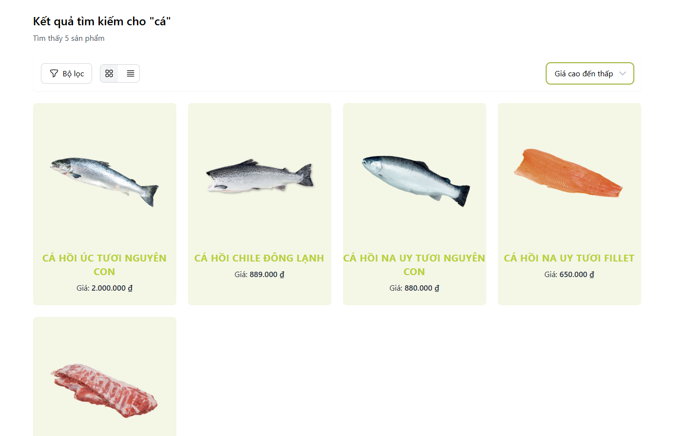

# Foodeii (Website for Client)
A Fresh Food eCommerce platform specializing in organic and healthy food products, featuring personalized food recommendations to help customers discover quality fresh products. With an extensive collection spanning multiple food categories, we cater to diverse dietary preferences and healthy eating habits.

## Features

- User-Friendly Interface
- Diverse Range of Food Categories
- Regularly Updated Inventory
- Detailed Product Information
- Add Products to the Shopping Cart
- Proceed to Checkout
- Search Functionality
- Manage Profile

## Requirement
- Development environment:
    - React.js 18.2.0+ for frontend development.
    - Visual Studio 2022 or VS Code
    - Tailwind CSS for styling.
    - MongoDB for database
      
## Installation Guide

To install and run the project locally, follow these steps:

1. Clone this repo.
2. Run `npm install` to install the dependencies.
3. Run `npm start` to start the server.

## User Interface

## Authors

[Lê Quốc Dũng](https://github.com/DungLe2983)

[Phạm Thanh Đồng ](https://github.com/ThanhDong00)

